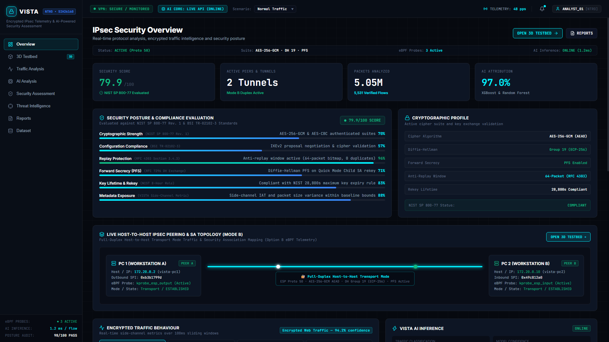
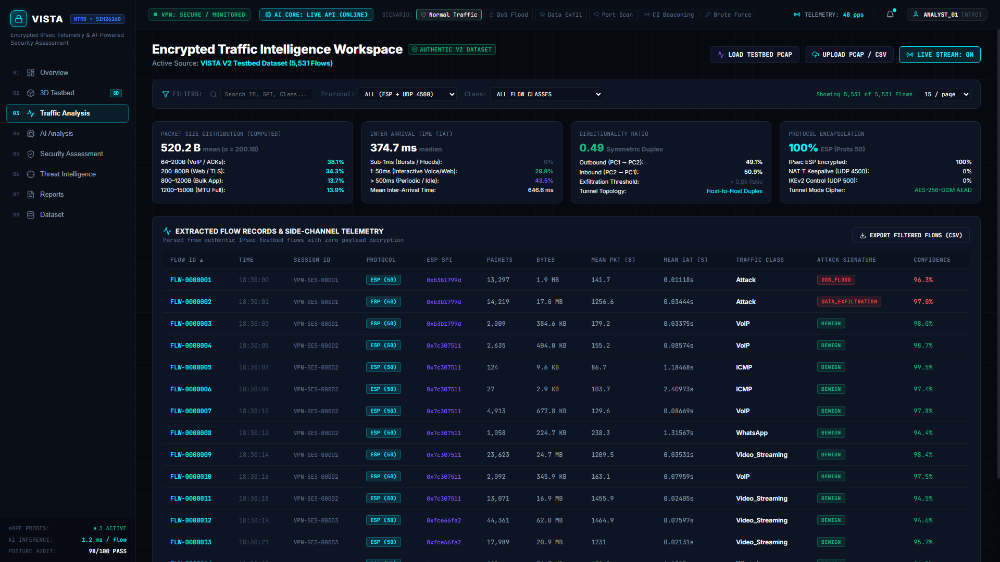
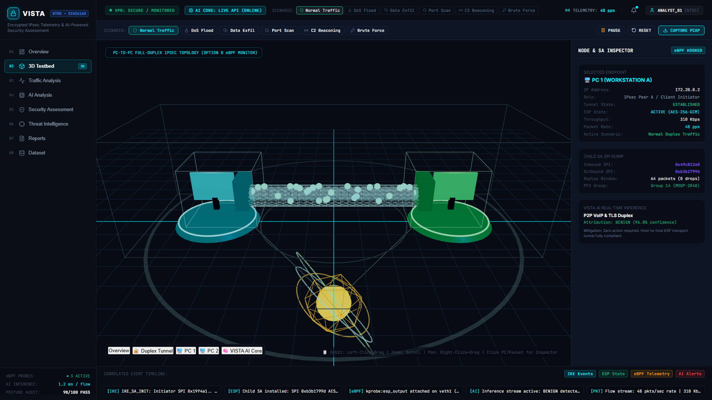
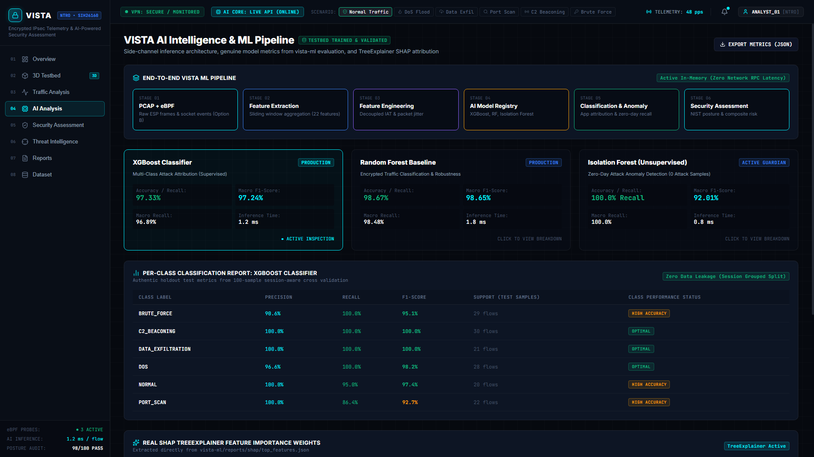
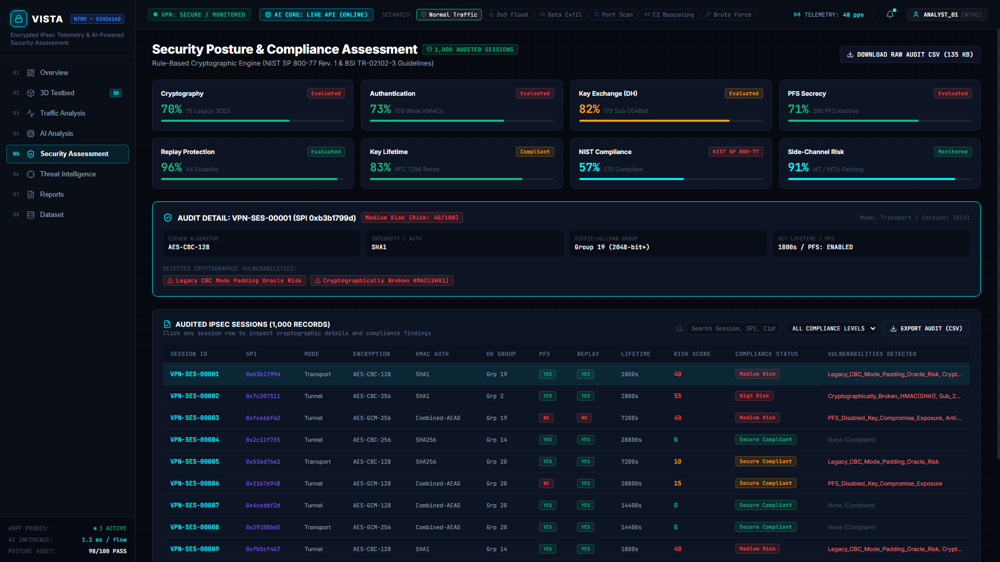
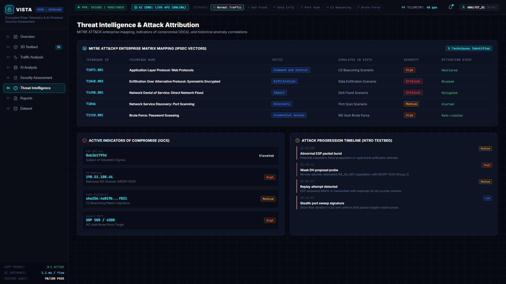
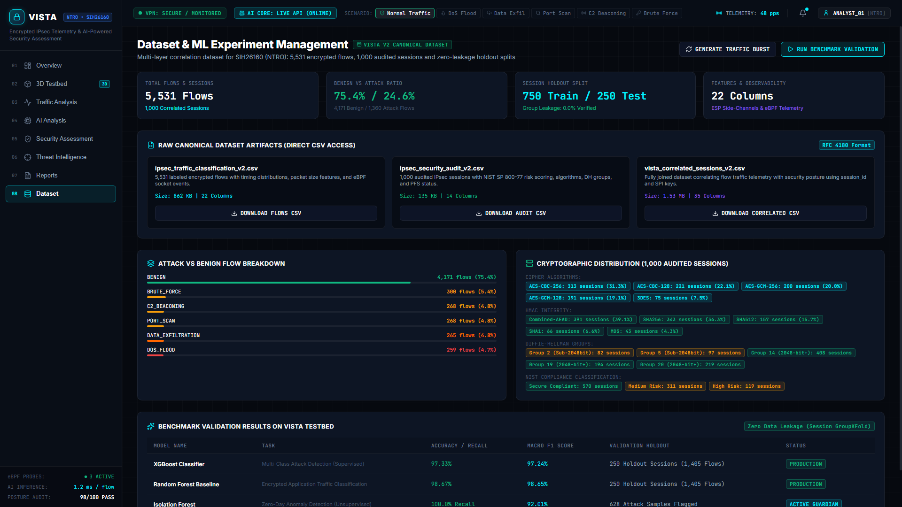
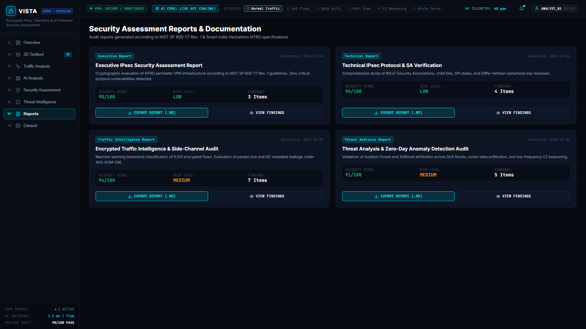

# VISTA: AI-Powered IPsec VPN Protocol Analyzer & Security Assessment Framework
### Smart India Hackathon 2026 · Problem Statement SIH26160
**Organization:** National Technical Research Organisation (NTRO)  
**Theme:** Blockchain & Cybersecurity  

---

## 1. Overview

VISTA is an end-to-end cybersecurity intelligence platform designed to analyze IPsec VPN deployments from captured or live network traffic. Without breaking or inspecting encrypted payloads, VISTA extracts flow-level and protocol metadata (ESP SPIs, packet timing, direction ratios, IKE negotiation headers) and applies trained Machine Learning models (XGBoost, Random Forest, Isolation Forest) to infer traffic patterns, detect cyberattacks, and audit cryptographic compliance against **NIST SP 800-77 Rev. 1** and **BSI TR-02102-3**.

---

## 2. User Interface Showcase

The VISTA SOC platform provides a unified operations console for defense analysts, SOC operators, and cryptographic auditors.

### 2.1 IPsec Security Overview & Posture Dashboard
> Real-time protocol status (IKEv2, ESP Proto 50, AES-256-GCM), Mode B host-to-host duplex peering topology (Workstation A ↔ Workstation B), NIST SP 800-77 compliance scores, side-channel metadata risk, and live eBPF stream status.



---

### 2.2 Encrypted Traffic Intelligence & Flow Inspector
> Inspection of 5,531+ encrypted testbed flows with zero payload decryption. Computes packet size distributions, inter-arrival time (IAT) variance, directionality ratios, and per-flow AI classification.



---

### 2.3 3D Interactive IPsec Testbed & Kernel eBPF Telemetry
> Interactive WebGL Three.js 3D visualization of full-duplex IPsec host-to-host and tunnel-mode communications with real-time packet flow animations, XFRM SA state inspector, and eBPF kernel hooks.



---

### 2.4 AI Intelligence & ML Model Registry
> Production inference pipelines: XGBoost (97.3% F1 Multi-Class Attack Attribution), Random Forest (98.6% Macro F1), and unsupervised Isolation Forest for zero-day anomaly detection with TreeExplainer SHAP attribution.



---

### 2.5 Security Posture & NIST SP 800-77 Compliance Engine
> Automated cryptographic evaluation of 1,000+ IPsec sessions against NIST SP 800-77 Rev. 1 & BSI TR-02102-3. Flags SWEET32 (3DES), legacy CBC padding oracles, broken HMACs (MD5/SHA1), and sub-2048-bit DH groups.



---

### 2.6 Threat Intelligence & MITRE ATT&CK® Enterprise Mapping
> Correlation of active IPsec attacks (DoS floods, data exfiltration, C2 beaconing, port sweeps, and IKE brute-force) to MITRE ATT&CK techniques with live Indicators of Compromise (IOCs) and progression timelines.



---

### 2.7 Canonical Dataset Management & Benchmark Validation
> Transparent management of 5,531 flows across 1,000 correlated sessions with GroupKFold session-aware zero-leakage splits, cryptographic cipher distributions, and verifiable benchmark metrics.



---

### 2.8 Audit Documentation & Automated Compliance Reporting
> One-click generation and export of technical and executive audit documentation according to NTRO defense specifications.



---

## 3. System Architecture

```
┌────────────────────────────────────────────────────────────────────────┐
│                   VISTA MODE B ARCHITECTURE MAP                        │
│                                                                        │
│  [ frontend: vista-dashboard/ ] ──(REST / WebSocket)──┐                │
│    • React + Vite SOC Dashboard                       │                │
│    • In-browser PCAP & CSV parser (fallback)          ▼                │
│    • 3D WebGL Duplex Peering Canvas        [ backend: FastAPI API ]    │
│    • Dynamic Security Scorecard              • /api/analyze/pcap       │
│                                              • /api/analyze/csv        │
│  [ topology: Mode B IPsec Testbed ]          • /api/audit/sessions     │
│    • vista-pc1 (Workstation A: 172.20.0.2)   • /api/soc/status         │
│    • vista-pc2 (Workstation B: 172.20.0.10)  • /api/ml/metrics         │
│    • Full-Duplex Transport Mode (Proto 50)   • /api/ebpf/events        │
│    • AES-256-GCM / SHA256 / DH Group 19               │                │
│                                                       ▼                │
│                                            [ vista-ml: AI Engine ]     │
│  [ captures/ ] ──(PCAP Replay)─────────────> • Scapy Packet Decoder    │
│    • Real StrongSwan ESP & IKE PCAPs         • XGBoost (Attack Class)  │
│    • eBPF Socket / XFRM Kernel Telemetry     • Random Forest (98.7% F1)│
│                                              • Isolation Forest (Anom) │
│                                              • SHAP Explainability     │
└────────────────────────────────────────────────────────────────────────┘
```

---

## 4. Quick Start & Execution

### Option A: One-Click Launch (PowerShell)
```powershell
powershell -ExecutionPolicy Bypass -File .\start_vista.ps1
```
This automatically starts:
1. **FastAPI AI Core API** at `http://localhost:8000` (Interactive docs at `/docs`)
2. **Vite Cyber SOC Dashboard** at `http://localhost:5173`

---

### Option B: Manual Execution

#### 1. Start the FastAPI Backend
```bash
# Using the preconfigured virtual environment:
.\vista-ml\.venv\Scripts\python run_backend.py --port 8000
```
- API Health: `http://localhost:8000/`
- Swagger UI: `http://localhost:8000/docs`

#### 2. Start the Frontend Dashboard
```bash
cd vista-dashboard
npm install
npm run dev
```
Open `http://localhost:5173` in your browser.

---

## 5. Key Capabilities & Implemented Features

### 5.1 Real Packet Analysis & IKE Parsing
- **ESP Packet Extraction (Protocol 50):** Automatically decodes Security Parameter Index (SPI) values directly from raw packets (e.g., `0xc6dd300d`).
- **IKEv1 / IKEv2 Negotiation Parsing (UDP 500 & NAT-T 4500):** Decodes ISAKMP headers, Initiator/Responder SPIs, exchange types (IKE_SA_INIT), and extracts the exact major/minor protocol version byte.

### 5.2 Live Machine Learning Inference
- **Trained Classifiers:** XGBoost (`xgboost_classifier.joblib`) and Random Forest (`random_forest_baseline.joblib`).
- **Attack Classes:** `NORMAL`, `DOS`, `PORT_SCAN`, `BRUTE_FORCE`, `C2_BEACONING`, `DATA_EXFILTRATION`.
- **Honest Probability Outputs:** Real probability distributions and confidence scores via `predict_proba()`.
- **Zero-Day Anomaly Detection:** Scored via scikit-learn Isolation Forest (`isolation_forest.joblib`).
- **ONNX Model Artifacts:** Standalone `.onnx` models in `vista-ml/models/onnx/` (`xgboost_classifier.onnx`, `random_forest_baseline.onnx`, `isolation_forest.onnx`) for cross-platform deployment on ONNX Runtime (C++, Rust, Go, WebAssembly).
- **Explainability:** SHAP feature attribution metrics generated via TreeExplainer.

### 5.3 Deterministic NIST Compliance Engine
Evaluates session configurations against:
- **NIST SP 800-77 Rev. 1** (Guide to IPsec VPNs)
- **BSI TR-02102-3** (Cryptographic Mechanisms for IPsec)
Identifies vulnerabilities:
- Legacy 3DES (SWEET32) & CBC Padding Oracle risks
- Deprecated HMAC algorithms (MD5 / SHA-1)
- Sub-2048-bit Diffie-Hellman groups
### 5.4 Live eBPF Kernel Ingestion & Correlation
- **Kernel Program (`ebpf/vista_ipsec_monitor.bpf.c`):** Implements BPF CO-RE tracing on Linux kernel `kprobe/xfrm_output`, `kprobe/xfrm_input`, and `tracepoint:sock:sock_sendmsg`. Streams events via a 256 KB BPF Ring Buffer (`BPF_MAP_TYPE_RINGBUF`).
- **Telemetry Agent (`ebpf/vista_ebpf_agent.py`):** Collects kernel events, tracking PID, process name (`comm`), SPI, sequence counters, and packet lengths.
- **PCAP + eBPF Feature Fusion:** Correlates wire-level ESP flows with host socket telemetry using `vista_ml.features.fusion.fuse_pcap_ebpf()` to identify the exact origin process behind encrypted tunnels without inspecting payloads.
- **Dashboard Stream:** Live streaming telemetry panel in `OverviewView.jsx` connected to `/api/ebpf/events`.

---

## 6. Mode B IPsec Testbed Configuration

Located in `configs/`:
- `client-swanctl.conf` / `gateway-swanctl.conf`: Primary Mode B Host-to-Host Full-Duplex Transport Mode between Workstation A (`172.20.0.2`) and Workstation B (`172.20.0.10`) with AES-256-GCM AEAD & Diffie-Hellman Group 19 (ECP-256).
- `client-cbc-swanctl.conf` / `gateway-cbc-swanctl.conf`: AES-256-CBC cipher baseline for comparative side-channel & padding oracle benchmarking.

---

## 7. Verification & Test Suite

Run backend integration test suite:
```bash
.\vista-ml\.venv\Scripts\python backend\test_api.py
```
Run ML unit tests:
```bash
cd vista-ml
.\.venv\Scripts\pytest -q
```
Verify frontend build:
```bash
cd vista-dashboard
npm run build
```
