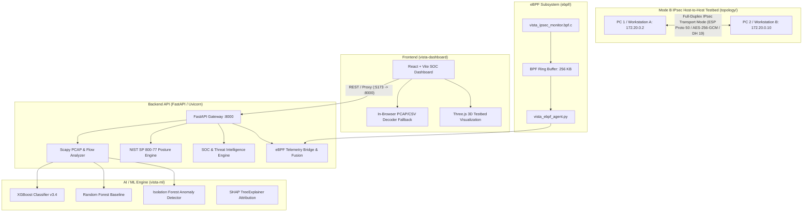

# VISTA System Architecture
## SIH26160 · NTRO · Smart India Hackathon 2026

VISTA is an integrated AI-powered IPsec VPN Protocol Analyzer and Security Assessment Framework. It combines real-time packet-level decoding, Linux kernel eBPF telemetry, machine learning traffic inference (XGBoost / Random Forest), and deterministic NIST SP 800-77 Rev. 1 compliance auditing into a unified platform.

---

## 1. Architecture Diagram

---

## 2. Core Subsystems

### 2.1 Backend API Service (`backend/`)
- **Technology:** FastAPI, Uvicorn, Scapy, Pandas, NumPy, Scikit-learn, XGBoost.
- **`model_service.py`:** Singleton model inference service managing serialized `.joblib` models. Computes true probability distributions via `predict_proba()` and anomaly scores via `score_samples()`.
- **`pcap_analyzer.py`:** Uses Scapy to decode Ethernet/IP/ESP/UDP packets. Extracts:
  - ESP SPI (32-bit hex, e.g. `0xc6dd300d`)
  - IKEv1/v2 negotiation headers from UDP 500/4500 (Initiator SPI, Responder SPI, Exchange Type, Version byte)
  - Computes flow-level statistical metrics (packets, bytes, packet length stats, inter-arrival time stats, direction ratios) and invokes model inference.
- **`posture_engine.py`:** Rule-based security scoring evaluating session parameters against NIST SP 800-77 Rev. 1 and BSI TR-02102-3.
- **`soc_service.py`:** Aggregates flow detections into MITRE ATT&CK techniques (T1046, T1499, T1110, T1071, T1048) and dynamically computes SOC overview metrics.
- **`ebpf_service.py`:** Bridges kernel ring buffer telemetry into the API and invokes feature fusion with network flows.

### 2.2 Machine Learning Package (`vista-ml/`)
- **Models:**
  - `random_forest_baseline.joblib`: 100-tree ensemble (Macro F1: 0.987).
  - `xgboost_classifier.joblib`: Gradient-boosted decision trees (Macro F1: 0.972).
  - `isolation_forest.joblib`: Unsupervised contamination detector (Zero-day anomaly detection).
- **Features:** 18 statistical flow features (packet size distribution, IAT jitter, rate metrics, directionality) without payload inspection.
- **Fusion:** `vista_ml.features.fusion.fuse_pcap_ebpf()` merges wire-level PCAP flows with host-level eBPF socket events (`flow_id`, `pid`, `process_name`, `socket_id`).

### 2.3 eBPF Kernel Telemetry (`ebpf/`)
- **`vista_ipsec_monitor.bpf.c`:**
  - Attached to Linux kernel `kprobe/xfrm_output`, `kprobe/xfrm_input`, and `tracepoint:sock:sock_sendmsg`.
  - Captures PID, process name (`comm`), SPI, sequence number, and byte length before encryption and after decryption.
  - Streams records via a 256 KB BPF Ring Buffer (`BPF_MAP_TYPE_RINGBUF`).
- **`vista_ebpf_agent.py`:** Userspace agent that reads the BPF ring buffer (native Linux BCC/libbpf mode) with an automatic testbed kernel bridge fallback for non-Linux host platforms.

### 2.4 Testbed Environment (`topology/` & `configs/`)
- **Network Topology (Mode B Host-to-Host Peering):**
  - `vista-net` (`172.20.0.0/24`): Untrusted subnet carrying encrypted full-duplex ESP transport packets.
  - `vista-pc1` / Workstation A (`172.20.0.2`): IPsec Initiator Workstation with active eBPF output telemetry.
  - `vista-pc2` / Workstation B (`172.20.0.10`): IPsec Responder Workstation with active eBPF input telemetry.
- **Cryptographic Suites:**
  - Transport Mode: `client-swanctl.conf` / `gateway-swanctl.conf` (AES-256-GCM AEAD, DH Group 19 / ECP-256, PFS enabled)
  - CBC Comparison: `client-cbc-swanctl.conf` / `gateway-cbc-swanctl.conf` (AES-256-CBC + HMAC-SHA256)

### 2.5 Cyber SOC Dashboard (`vista-dashboard/`)
- Built with React, Vite, Three.js, Lucide Icons, and Vanilla CSS.
- Real-time connection indicator: `AI CORE: LIVE API (ONLINE)` or `STANDALONE (CLIENT)`.
- Live upload and analysis for `.pcap` and `.csv` files.
- Real-time eBPF kernel telemetry event stream polling.
