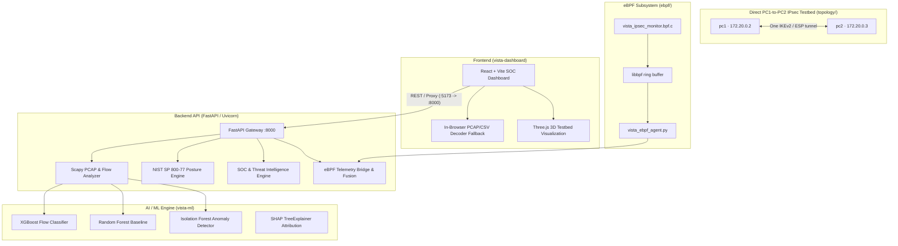

# VISTA System Architecture
## SIH26160 · NTRO · Smart India Hackathon 2026

VISTA is an integrated AI-powered IPsec VPN Protocol Analyzer and Security Assessment Framework. It combines real-time packet-level decoding, Linux kernel eBPF telemetry, machine learning traffic inference (XGBoost / Random Forest), and deterministic NIST SP 800-77 Rev. 1 compliance auditing into a unified platform.

---

## 1. Architecture Diagram

---

## 2. Core Subsystems

### 2.1 Backend API Service (`backend/`)
- **Technology:** FastAPI, Uvicorn, Scapy, Pandas, NumPy, Scikit-learn, XGBoost.
- **`model_service.py`:** Singleton inference service managing serialized `.joblib` models. It uses each classifier's recorded feature order, rejects incomplete feature rows, exposes uncalibrated `predict_proba()` model probabilities, and returns Isolation Forest outlier scores separately.
- **`pcap_analyzer.py`:** Uses Scapy to decode Ethernet/IP/ESP/UDP packets. Extracts:
  - ESP SPI (32-bit hex, e.g. `0xc6dd300d`)
  - IKEv1/v2 negotiation headers from UDP 500/4500 (Initiator SPI, Responder SPI, Exchange Type, Version byte)
  - Computes flow-level statistical metrics (packets, bytes, packet length stats, inter-arrival time stats, direction ratios) and invokes model inference.
- **`posture_engine.py`:** Rule-based security scoring evaluates explicitly supplied session parameters against NIST SP 800-77 Rev. 1 and BSI TR-02102-3. Bundled audit rows are generated scenarios and are not exposed as operational audit results; in the absence of an operational audit source, summary scores/rates remain unavailable.
- **`soc_service.py`:** Maps successful, supported ML flow predictions to possible MITRE ATT&CK techniques and labels them unverified; it does not treat repository dataset labels or predictions as confirmed incidents.
- **`ebpf_service.py`:** Bridges collector API events into the backend and invokes feature fusion with network flows.

### 2.2 Machine Learning Package (`vista-ml/`)
- **Models:**
  - `random_forest_baseline.joblib`: 100-tree ensemble (Macro F1: 0.987).
  - `xgboost_classifier.joblib`: Gradient-boosted decision trees (Macro F1: 0.972).
  - `isolation_forest.joblib`: Unsupervised contamination detector (Zero-day anomaly detection).
- **Features:** 18 statistical flow features (packet size distribution, IAT jitter, rate metrics, directionality) without payload inspection.
- **Fusion:** `vista_ml.features.fusion.fuse_pcap_ebpf()` provides a PCAP/eBPF feature-fusion path. Current native collector events have PID/process metadata but do not yet include reliable flow or socket identifiers, so per-flow attribution is not established.

### 2.3 eBPF Kernel Telemetry (`ebpf/`)
- **CO-RE build/load:** `collector_server.py` verifies `/sys/kernel/btf/vmlinux`, generates `vmlinux.h` with `bpftool`, compiles `vista_ipsec_monitor.bpf.c` to a `.bpf.o` with Clang, then starts the small `libbpf_loader.c` program. The loader loads and attaches the object with libbpf and forwards ring-buffer records to the unchanged collector HTTP API.
- **Hooks:** kprobes on `xfrm_output`, `xfrm_input`, `sock_sendmsg`, `udp_sendmsg`, and `__sys_sendto`. Events include kernel timestamp, PID/process name, event type, and skb length for XFRM hooks. The SPI field is nullable; process attribution is not a reliable per-flow correlation.
- **`vista_ebpf_agent.py`:** Backend client polls the collector API. If BTF, capabilities, object load, or probe attachment is unavailable, it reports `UNAVAILABLE` and returns no events; no synthetic kernel events are generated.
- **Runtime:** Start the opt-in `ebpf` Compose profile. BPF object compilation uses the running kernel's BTF, not `/lib/modules/.../build`. Docker Desktop WSL2 must allow BPF/perf probe attachment and expose usable BTF.
- **Fusion boundary:** Events are kernel observations; they are not reliably correlated to an individual network flow.

### 2.4 Testbed Environment (`topology/` & `configs/`)
- **Network Topology:** `pc1` (`172.20.0.2`) and `pc2` (`172.20.0.3`) are the only IPsec endpoints. They share one Compose-managed bridge and negotiate a direct tunnel with selectors `172.20.0.2/32` ↔ `172.20.0.3/32`. No gateway, protected server, or forwarding path participates.
- **Runtime:** Both endpoints run StrongSwan in Debian Bookworm containers. The separate `vista-ebpf-monitor` observes host-kernel XFRM/socket probes and is not an IPsec endpoint. The direct tunnel requires no SNAT or routed protected subnet.
- **Cryptographic Suites:** The default tunnel uses IKEv2 AES-256/SHA-256/MODP-2048 and ESP AES-256-GCM. Direct-peer CBC comparison configurations remain in `configs/`.

### 2.5 Cyber SOC Dashboard (`vista-dashboard/`)
- Built with React, Vite, Three.js, Lucide Icons, and Vanilla CSS.
- Real-time connection indicator: `AI CORE: LIVE API (ONLINE)` or `STANDALONE (CLIENT)`.
- Live upload and analysis for `.pcap` and `.csv` files.
- Real-time eBPF kernel telemetry event stream polling.
